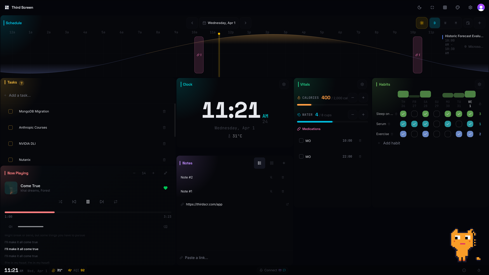

# Third Screen

Second screen is when you're on your phone while Netflix plays in the background—the TV becomes secondary. **Third Screen** is the opposite: one glance gives you everything you don't stare at constantly.

A macOS dashboard that surfaces all your ambient info in one place: time, schedule, todos, media, batteries, shortcuts. No digging through apps.

## Integrations

| Integration | Purpose |
|-------------|---------|
| **Spotify** | Now playing, playback controls, lyrics (via Lrclib) |
| **Google Calendar** | Events, meeting links (Meet, Zoom, etc.) |
| **Apple Calendar** | Local calendar events |
| **Apple Reminders** | Todos via "Third Screen" list |
| **Apple Shortcuts** | Run shortcuts from the dashboard |
| **Battery** | Internal + Bluetooth accessories (AirPods, etc.) |
| **Lrclib.net** | Lyrics for Spotify tracks |

## Screenshots

## Requirements

- macOS
- Spotify & Google OAuth credentials (configure in Info.plist)
