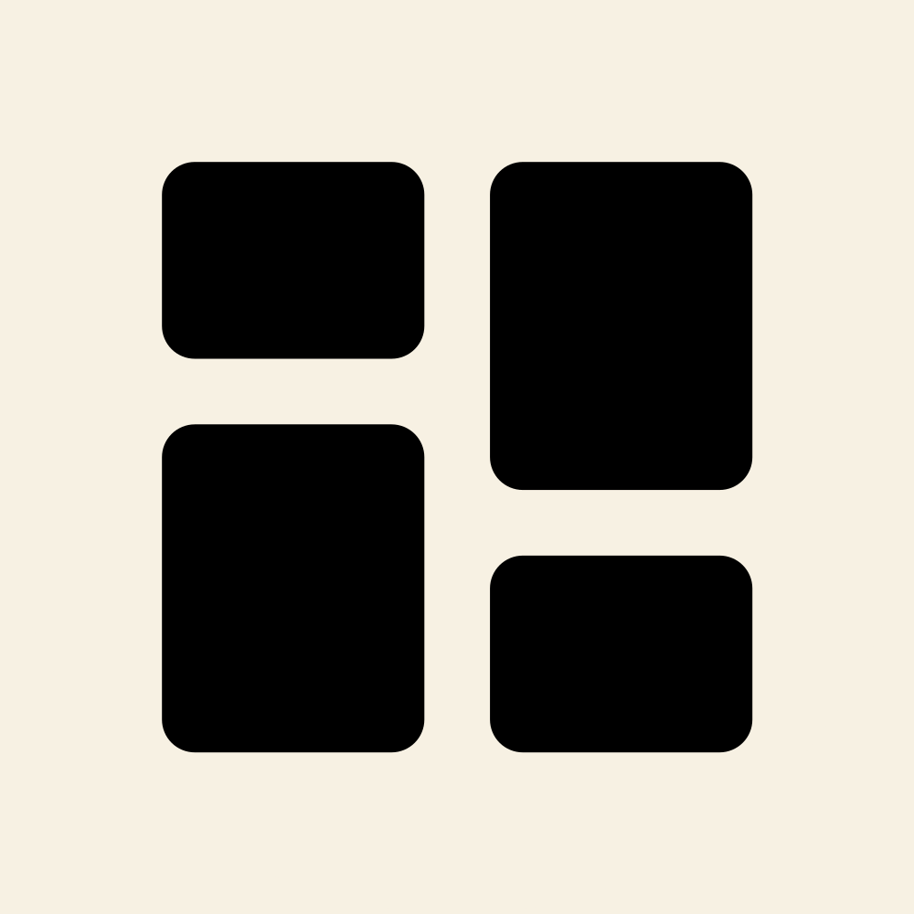
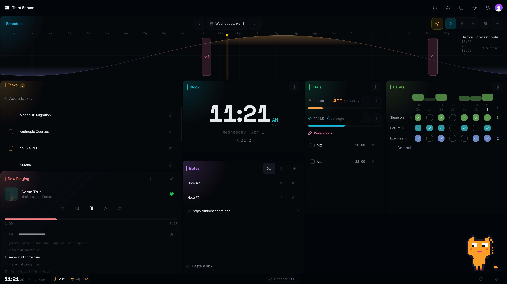

# Third Screen

<p align="center">
  
  <br/>
  
</p>

<p align="center">
  <a href="#zones"></a>
  <a href="#features"></a>
  <a href="#features"></a>
  <a href="#features"></a>
</p>

<p align="center">
  <strong>A zero-scroll personal dashboard that shows your entire day in a single viewport.</strong><br/>
  Calendar, tasks, notes, health vitals, smart home controls, and a status bar. All at a glance, no scrolling.<br/>
  Open source. Local-first. Works in any browser, on any screen.
</p>

<p align="center">
  
</p>

---

## What is Third Screen?

Third Screen is an **open-source, self-hosted personal dashboard** designed for glanceable, ambient information display. It puts your schedule, tasks, notes, health tracking, and smart home controls on a single screen with zero scrolling.

Use it as a **wall-mounted tablet dashboard**, a **Raspberry Pi kiosk display**, an **iPad home dashboard**, a **desktop daily overview**, or a **digital signage screen** for your home or office.

Think of it as a free, open-source alternative to [DAKboard](https://dakboard.com) and [MagicMirror](https://magicmirror.builders), but built as a modern web app that works in any browser without custom hardware.

### Who is it for?

- **Anyone who wants their whole day on one screen** without jumping between calendar, task, and health apps
- **Smart home users** who want a Home Assistant dashboard alongside their daily schedule
- **Families** looking for a digital family command center or shared household display
- **Makers and hobbyists** who want a Raspberry Pi dashboard or tablet kiosk project
- **Productivity-focused people** who want a unified daily planner dashboard
- **Self-hosters** who want a privacy-first, local-first personal dashboard with no cloud dependency

---

## Zones

Third Screen uses a zone-based layout where each zone fills a fixed region of the viewport. No cards to arrange, no scrolling, no page navigation.

| | Zone | What it shows |
|:---:|---|---|
| 📅 | **Timeline** | Day/week/month calendar views, Google Calendar events, meeting links, RSVP |
| ✅ | **Tasks** | Task list with inline add, check-off, and reorder |
| 📝 | **Notes** | Quick notes with link bookmarks |
| 💊 | **Vitals** | Calorie tracking, water intake ring gauges, medicine dose logging |
| 🏠 | **Smart Home** | Home Assistant lights, switches, fans, climate with live state and control |
| 🕐 | **Status Bar** | Clock, notification ticker, countdown timer, Spotify now playing with lyrics |

---

## Features

### Glanceable by design
- **Zero-scroll dashboard** that fits everything in a single viewport on any screen shape
- **Viewport-adaptive layout** that works on landscape, portrait, square, and ultrawide displays
- **Passive information display** designed for looking at, not constantly interacting with
- Built for **ambient computing** and **calm technology** principles

### Personal life dashboard
- **Google Calendar** integration with multi-account OAuth support
- **Task management** with inline add, completion, and reorder
- **Notes** with embedded link bookmarks
- **Health tracking**: calorie counter, water intake rings, medicine dose logging
- **Countdown timer** and clock in the status bar

### Smart home integration
- **Home Assistant** integration for lights, switches, fans, and climate devices
- Live entity state polling with optimistic toggle UI
- Brightness, color, and color temperature controls for smart lights
- Works with any Home Assistant instance accessible over HTTPS

### Music and media
- **Spotify** playback controls with album art
- **Synced lyrics** display during playback
- Now playing in the status bar with notification ticker

### Privacy and storage
- **Local-first**: all data stored in your browser by default, no account required
- **Self-hosted** option with SQLite database for server deployments
- **Offline-capable**: works without internet for local data
- No telemetry, no analytics, no tracking
- Your data stays on your device

### Design and UX
- **Dark-first glass UI** with backdrop blur and per-zone accent colors
- **Touch-friendly** for tablets, iPads, and wall-mounted touchscreen displays (44px minimum touch targets)
- **Pixel art mascot** companion that reacts to your actions with synthesized sounds
- Responsive to any screen size and aspect ratio

---

## Use Cases

| Use case | Setup |
|---|---|
| **Wall-mounted tablet dashboard** | iPad or Android tablet in a wall mount, open Third Screen in fullscreen/kiosk mode |
| **Raspberry Pi kiosk display** | Pi with a touchscreen or HDMI monitor, Chromium in kiosk mode |
| **Desktop daily overview** | Browser tab or Electron app on your Mac, Windows, or Linux desktop |
| **Kitchen command center** | Tablet on a stand showing family schedule, meal tracking, and smart home controls |
| **Office status board** | TV or monitor displaying team schedule, tasks, and real-time status |
| **Bedside morning briefing** | Small display showing today's schedule, tasks, and weather at a glance |
| **Digital signage display** | Any screen running a browser in fullscreen for ambient information |
| **Family hub display** | Shared household dashboard with calendar, chores, and meal planning |
| **Smart home control panel** | Wall tablet for controlling Home Assistant lights, switches, and climate |

---

## Tech Stack

| Layer | Technology |
|---|---|
| Framework | Next.js 16 + React 19 |
| Language | TypeScript 5.9 |
| Styling | Tailwind CSS 4 + shadcn/ui (Radix) |
| Database | SQLite via better-sqlite3 + Drizzle ORM |
| Desktop | Electron (planned) |
| Package manager | Bun |

---

## Getting Started

```bash
git clone https://github.com/mager/thirdscreen.git
cd thirdscreen/web_app/thirdscreen
bun install
bun run dev
```

Open [http://localhost:3000](http://localhost:3000) in your browser. Your dashboard is ready. No account needed, no configuration required. Data is stored locally in your browser.

### Self-hosted server mode

Set `NEXT_PUBLIC_STORAGE=server` to use the SQLite database backend instead of localStorage. The database file is created automatically on first run.

```bash
NEXT_PUBLIC_STORAGE=server bun run dev
```

### Raspberry Pi / Kiosk deployment

Build the production version and serve it, then open Chromium in kiosk mode:

```bash
bun run build
bun run start
# In another terminal:
chromium-browser --kiosk http://localhost:3000
```

---

## Integrations

| Integration | Status | Description |
|---|---|---|
| Google Calendar | Available | Multi-account OAuth with PKCE, day/week/month views |
| Home Assistant | Available | Lights, switches, fans, climate via REST API |
| Spotify | Available | Playback controls, album art, synced lyrics |
| Google Tasks / Todoist | Planned | External task provider sync |
| Apple Health / Google Fit | Planned | Health data import |
| Outlook Calendar | Planned | Microsoft 365 calendar integration |

---

## Comparison

| Feature | Third Screen | DAKboard | MagicMirror | Home Assistant |
|---|:---:|:---:|:---:|:---:|
| Zero-scroll single viewport | Yes | No | No | No |
| Open source | Yes | No | Yes | Yes |
| No custom hardware required | Yes | No | No | Yes |
| Calendar + Tasks + Health in one view | Yes | Partial | Via modules | Via cards |
| Local-first / offline | Yes | No | Yes | No |
| Smart home controls | Yes | No | Via modules | Yes |
| No account required | Yes | No | Yes | No |
| Browser-based | Yes | Yes | Electron | Yes |
| Touch-optimized | Yes | Limited | Limited | Yes |
| Free | Yes | Freemium | Yes | Yes |

---

## Screenshots

<p align="center">
  
</p>

---

## Contributing

Contributions are welcome. See the codebase structure in [CLAUDE.md](CLAUDE.md) for architecture details.

---

## Keywords

<sub>personal dashboard, personal dashboard app, glanceable dashboard, zero-scroll dashboard, self-hosted dashboard, open source dashboard, home dashboard, wall-mounted dashboard, tablet dashboard, iPad dashboard app, Raspberry Pi dashboard, kiosk mode dashboard, daily overview dashboard, morning briefing display, ambient information display, calm technology dashboard, digital signage software, information radiator, status board app, family command center, smart home dashboard, Home Assistant dashboard alternative, DAKboard alternative, MagicMirror alternative, productivity dashboard, all-in-one dashboard, life dashboard, daily planner dashboard, personal information display, always-on display, touchscreen dashboard, local-first dashboard, offline dashboard, privacy-first dashboard, self-hosted personal dashboard, digital family organizer, health dashboard, calorie tracker dashboard, task and calendar dashboard, single screen dashboard, one glance dashboard, ambient display, smart display, home hub, control panel display, startpage, homepage dashboard</sub>

---

<p align="center">
  Made by <a href="https://ericvaish.com">Eric Vaish</a>
</p>
